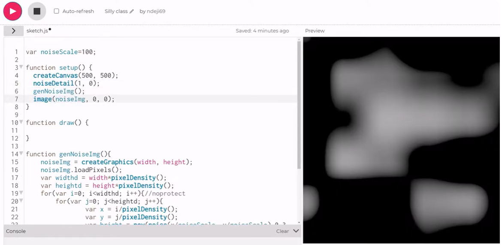

# xili0870_9103_tut5
My first repository for IDEA9103

This is my first local change to the repo!

# Heading 1
## Heading 2
### Heading 3
#### Heading 4
##### Heading 5
###### Heading 6

**Bold text** or_Bold Text_

*Italics Text* or_Italics Text

- Item 1
- Item 2
- Item 3

1. First Item
1. Second Item
1. Second Second Item
1. Third Item

[link text](https://www.google.com)


```
function helloWorld(){
    console.log("Hello world);
}
```

Update the 'draw()' function to include a for loop.

> This is a blockquote


# Quiz 8
# Imaging Technique Inspiration
My first repository for quiz8

The artwork shows the lively rotation of a turbine, and the creative image produced by particle spinning can make the operation appear more fascinating. The artistic image generated by the random rotation of noisy images and particles in the image can be fully applied to the project, making the way it looks more creative and the image more cool, resulting in a very exciting visual effect. If applied to the project, employing Perlin noise and random numbers or seeds to drive animation meets one of the rules' technical requirements.


# Coding Technique Exploration


[link image](https://www.youtube.com/watch?v=3YaTRWkpXpQ&list=TLPQMjkwNDIwMjT-zHo4vm9wmw&index=3)

First, we need to create a noise image and store it in the image buffer,set each pixel's nested loop, coordinates, color brightness.

Second, particles are created to depict movement, and random particles are generated using a for loop.



Third, set the particle drawing variables (brightness, transparency) and render.


Finally, access the gradient vector to shift the particles toward the brighter side. Create a Curl function that uses Perlin noise to calculate the rotation of a 2D vector field in order to simulate the particle system through the vector field at each point direction and intensity level.


